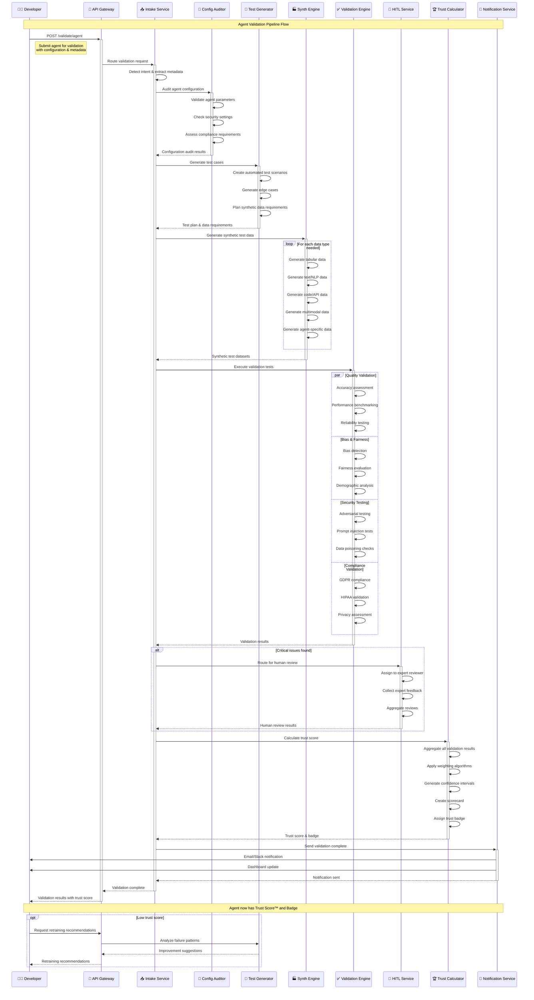
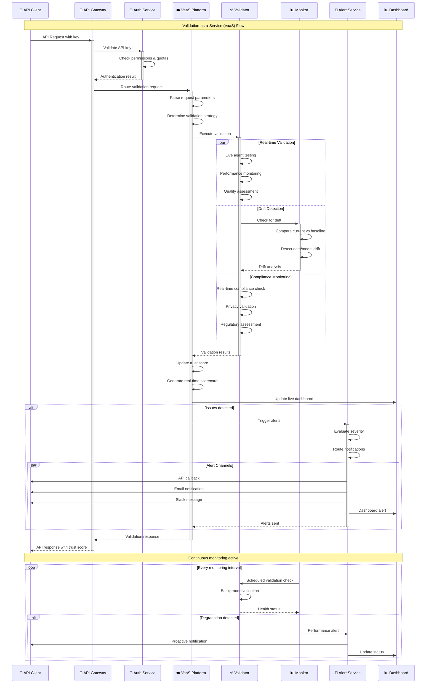
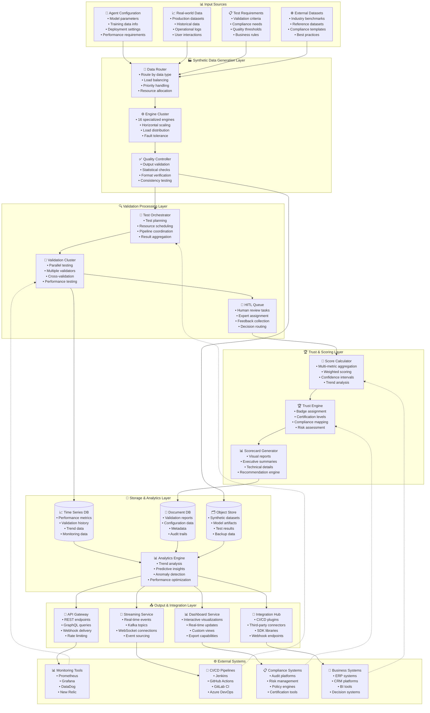

# Inferloop Agent Validation & Trust Framework (GATF™) - UML Design

## 1. Universal Use Case Diagram

```mermaid
graph TB
    %% Actors - All Domain Types
    subgraph DomainExperts["👥 Domain Experts"]
        FinanceExpert[💰 Finance Expert]
        HealthcareExpert[🏥 Healthcare Expert]
        LegalExpert[⚖️ Legal Expert]
        ManufacturingExpert[🏭 Manufacturing Expert]
        RetailExpert[🛍️ Retail Expert]
        CyberSecExpert[🛡️ CyberSec Expert]
        HRExpert[👤 HR Expert]
        ResearchExpert[🔬 Research Expert]
        DevOpsExpert[⚙️ DevOps Expert]
        AIResearcher[🤖 AI Researcher]
    end
    
    subgraph SystemActors["🔧 System Actors"]
        Developer[👨‍💻 AI Developer]
        DataScientist[👩‍🔬 Data Scientist]
        ComplianceOfficer[🛡️ Compliance Officer]
        SystemIntegrator[⚙️ System Integrator]
        EndUser[👤 End User]
        Admin[👑 System Admin]
        SafetyEngineer[🦺 Safety Engineer]
        EthicsOfficer[🔍 Ethics Officer]
    end
    
    %% External Systems
    subgraph ExternalSystems["🌐 External Systems"]
        CICDPipeline[🔄 CI/CD Pipeline]
        MonitoringSystem[📊 Monitoring System]
        APIConsumer[🔌 API Consumer]
        RegulatoryFramework[📋 Regulatory Framework]
        IndustryBenchmarks[📊 Industry Benchmarks]
        RealTimeData[📡 Real-time Data Sources]
    end
    
    %% Main System
    subgraph GATF["🏛️ Global AI Trust Framework (GATF™)"]
        
        %% Universal Data Generation
        subgraph UniversalDataGeneration["📊 Universal Synthetic Data Generation"]
            %% 16 Core Data Types
            UC1[Generate Tabular Data]
            UC2[Generate Text/NLP Data]
            UC3[Generate Code/DSL/API Data]
            UC4[Generate Audio/Speech Data]
            UC5[Generate Image Data]
            UC6[Generate Video/Simulation Data]
            UC7[Generate Time Series/IoT Data]
            UC8[Generate Knowledge Graphs]
            UC9[Generate Structured Documents]
            UC10[Generate Logs/Events Data]
            UC11[Generate RAG-Ready Pairs]
            UC12[Generate Multimodal Data]
            UC13[Generate Function Call Traces]
            UC14[Generate Dialogues/Multi-Agent]
            UC15[Generate Memory Scenarios]
            UC16[Generate Adversarial/Hallucination]
            
            %% Domain-Specific Extensions
            UC17[Generate Financial Transactions]
            UC18[Generate Medical Records]
            UC19[Generate Legal Contracts]
            UC20[Generate Manufacturing Telemetry]
            UC21[Generate Retail Inventory Data]
            UC22[Generate HR Performance Data]
            UC23[Generate Cybersecurity Threats]
            UC24[Generate Research Papers]
            UC25[Generate Gaming Scenarios]
            UC26[Generate IoT Sensor Networks]
        end
        
        %% Universal Validation Pipeline
        subgraph UniversalValidation["🔍 Universal Agent Validation Pipeline"]
            UC27[Intake & Intent Detection]
            UC28[Agent Configuration Audit]
            UC29[Multi-Domain Data Simulation]
            UC30[Cross-Vertical Test Generation]
            UC31[Automated Validation Engine]
            UC32[Human-in-the-Loop (HITL) Review]
            UC33[Domain-Specific Metric Calculation]
            UC34[Universal Trust Score Calculation]
            UC35[Adaptive Scorecard Generation]
            UC36[Dynamic Trust Badge Assignment]
            UC37[Intelligent Retraining Loop]
            UC38[Cross-Domain Performance Analysis]
            UC39[Bias & Fairness Assessment]
            UC40[Safety & Risk Evaluation]
        end
        
        %% Domain-Specific Validation Modules
        subgraph DomainValidationModules["🏢 Domain-Specific Validation Modules"]
            UC41[Finance & Banking Validation]
            UC42[Healthcare & Medical Validation]
            UC43[Legal & Compliance Validation]
            UC44[Manufacturing & QA Validation]
            UC45[Retail & E-commerce Validation]
            UC46[Cybersecurity & Threat Validation]
            UC47[HR & Recruitment Validation]
            UC48[Research & Academic Validation]
            UC49[Automotive & Transportation Validation]
            UC50[Gaming & Entertainment Validation]
            UC51[IoT & Smart Systems Validation]
            UC52[Customer Support & CRM Validation]
            UC53[DevOps & Observability Validation]
            UC54[Recommendation Systems Validation]
            UC55[Virtual Assistant & Accessibility Validation]
            UC56[Fashion & Creative Validation]
            UC57[Pharmaceutical & Drug Discovery Validation]
            UC58[Smart Cities & Urban Planning Validation]
            UC59[Robotics & Automation Validation]
            UC60[Autonomous Vehicle Validation]
        end
        
        %% VaaS Platform Extensions
        subgraph ExtendedVaaS["☁️ Extended Validation-as-a-Service"]
            UC61[Multi-Tenant Validation API]
            UC62[Domain-Aware Dashboard]
            UC63[Cross-Industry Benchmarking]
            UC64[Real-time Multi-Modal Validation]
            UC65[Adaptive Alert Management]
            UC66[Regulatory Compliance Monitoring]
            UC67[Performance Drift Detection]
            UC68[Automated Incident Response]
            UC69[Cross-Domain Knowledge Transfer]
            UC70[Federated Validation Networks]
        end
        
        %% Advanced Privacy & Ethics
        subgraph AdvancedPrivacyEthics["🔒 Advanced Privacy & Ethics"]
            UC71[Multi-Jurisdiction Compliance]
            UC72[Adaptive Differential Privacy]
            UC73[Contextual PII Detection]
            UC74[Cross-Cultural Bias Detection]
            UC75[Ethical Decision Framework]
            UC76[Transparent AI Validation]
            UC77[Stakeholder Impact Assessment]
            UC78[Responsible AI Governance]
            UC79[Global Regulatory Harmonization]
            UC80[Ethical AI Certification]
        end
        
        %% Quality & Performance Assurance
        subgraph QualityPerformance["✅ Universal Quality & Performance"]
            UC81[Cross-Modal Accuracy Assessment]
            UC82[Domain-Agnostic Performance Benchmarking]
            UC83[Universal Bias Detection]
            UC84[Multi-Vertical Fairness Evaluation]
            UC85[Adaptive Hallucination Detection]
            UC86[Dynamic Performance Optimization]
            UC87[Cross-Domain Reliability Testing]
            UC88[Universal Safety Validation]
            UC89[Contextual Accuracy Measurement]
            UC90[Intelligent Error Analysis]
        end
    end
    
    %% Enhanced Actor Relationships
    %% Domain Experts
    FinanceExpert --> UC41
    FinanceExpert --> UC17
    FinanceExpert --> UC34
    
    HealthcareExpert --> UC42
    HealthcareExpert --> UC18
    HealthcareExpert --> UC88
    
    LegalExpert --> UC43
    LegalExpert --> UC19
    LegalExpert --> UC71
    
    ManufacturingExpert --> UC44
    ManufacturingExpert --> UC20
    ManufacturingExpert --> UC87
    
    RetailExpert --> UC45
    RetailExpert --> UC21
    RetailExpert --> UC86
    
    CyberSecExpert --> UC46
    CyberSecExpert --> UC22
    CyberSecExpert --> UC67
    
    HRExpert --> UC47
    HRExpert --> UC22
    HRExpert --> UC83
    
    ResearchExpert --> UC48
    ResearchExpert --> UC23
    ResearchExpert --> UC89
    
    DevOpsExpert --> UC53
    DevOpsExpert --> UC10
    DevOpsExpert --> UC67
    
    AIResearcher --> UC15
    AIResearcher --> UC16
    AIResearcher --> UC85
    
    %% System Actors
    Developer --> UC27
    Developer --> UC31
    Developer --> UC61
    
    DataScientist --> UC1
    DataScientist --> UC7
    DataScientist --> UC82
    
    ComplianceOfficer --> UC71
    ComplianceOfficer --> UC66
    ComplianceOfficer --> UC78
    
    SystemIntegrator --> UC28
    SystemIntegrator --> UC70
    SystemIntegrator --> UC68
    
    SafetyEngineer --> UC88
    SafetyEngineer --> UC40
    SafetyEngineer --> UC77
    
    EthicsOfficer --> UC75
    EthicsOfficer --> UC80
    EthicsOfficer --> UC76
    
    Admin --> UC36
    Admin --> UC37
    Admin --> UC79
    
    EndUser --> UC34
    EndUser --> UC62
    EndUser --> UC35
    
    %% External Systems
    CICDPipeline --> UC61
    CICDPipeline --> UC68
    MonitoringSystem --> UC67
    MonitoringSystem --> UC65
    APIConsumer --> UC61
    APIConsumer --> UC64
    RegulatoryFramework --> UC66
    RegulatoryFramework --> UC71
    IndustryBenchmarks --> UC63
    IndustryBenchmarks --> UC82
    RealTimeData --> UC64
    RealTimeData --> UC29
```

## 2. Universal System Architecture Diagram

```mermaid
graph TB
    %% External Systems & Users
    subgraph External["🌐 External Ecosystem"]
        subgraph DomainUsers["👥 Domain Users"]
            FinanceUsers[💰 Finance Users]
            HealthcareUsers[🏥 Healthcare Users]
            LegalUsers[⚖️ Legal Users]
            ManufacturingUsers[🏭 Manufacturing Users]
            RetailUsers[🛍️ Retail Users]
            OtherVerticals[🌟 Other Verticals...]
        end
        
        subgraph IntegrationPoints["🔗 Integration Points"]
            MultiCICD[🔄 Multi-Platform CI/CD]
            CrossDomainSystems[⚙️ Cross-Domain Systems]
            IndustryMonitoring[📊 Industry Monitoring]
            RegulatoryAPIs[📋 Regulatory APIs]
            MarketDataFeeds[📡 Market Data Feeds]
        end
    end
    
    %% Universal API Gateway Layer
    subgraph UniversalAPILayer["🚪 Universal API Gateway Layer"]
        MetaAPIGateway[🌐 Meta API Gateway]
        DomainRouting[🎯 Domain-Aware Routing]
        UniversalAuth[🔐 Universal Authentication]
        AdaptiveRateLimit[⏱️ Adaptive Rate Limiting]
        IntelligentLoadBalancer[⚖️ Intelligent Load Balancer]
        CrossDomainOrchestrator[🎼 Cross-Domain Orchestrator]
    end
    
    %% Core Universal Services Layer
    subgraph UniversalServices["🏗️ Universal Services Layer"]
        
        subgraph UniversalValidationCore["🔍 Universal Validation Core"]
            MetaIntakeService[📥 Meta Intake Service]
            UniversalConfigAudit[🔧 Universal Config Audit]
            AdaptiveTestGenerator[🧪 Adaptive Test Generator]
            MetaValidationEngine[✅ Meta Validation Engine]
            IntelligentHITL[👤 Intelligent HITL Service]
            UniversalScorecardService[📊 Universal Scorecard Service]
            DynamicTrustBadgeService[🏆 Dynamic Trust Badge Service]
            CrossDomainAnalytics[📈 Cross-Domain Analytics]
        end
        
        subgraph UniversalDataEngines["🏭 Universal Synthetic Data Engines"]
            MetaDataOrchestrator[🎼 Meta Data Orchestrator]
            
            %% Core 16 Data Type Engines
            UniversalTabularEngine[📊 Universal Tabular Engine]
            UniversalTextEngine[📝 Universal Text/NLP Engine]
            UniversalCodeEngine[💻 Universal Code/DSL Engine]
            UniversalAudioEngine[🎵 Universal Audio Engine]
            UniversalImageEngine[🖼️ Universal Image Engine]
            UniversalVideoEngine[🎬 Universal Video Engine]
            UniversalTimeSeriesEngine[📈 Universal Time Series Engine]
            UniversalKnowledgeGraphEngine[🕸️ Universal Knowledge Graph Engine]
            UniversalDocumentEngine[📄 Universal Document Engine]
            UniversalLogEngine[📋 Universal Log Engine]
            UniversalRAGEngine[🔍 Universal RAG Engine]
            UniversalMultimodalEngine[🎭 Universal Multimodal Engine]
            UniversalFunctionTraceEngine[🔧 Universal Function Trace Engine]
            UniversalDialogueEngine[💬 Universal Dialogue Engine]
            UniversalMemoryEngine[🧠 Universal Memory Engine]
            UniversalAdversarialEngine[⚔️ Universal Adversarial Engine]
            
            %% Domain-Specific Extensions
            FinancialDataEngine[💰 Financial Data Engine]
            MedicalDataEngine[🏥 Medical Data Engine]
            LegalDataEngine[⚖️ Legal Data Engine]
            ManufacturingDataEngine[🏭 Manufacturing Data Engine]
            RetailDataEngine[🛍️ Retail Data Engine]
            CyberSecurityDataEngine[🛡️ CyberSecurity Data Engine]
            HRDataEngine[👤 HR Data Engine]
            ResearchDataEngine[🔬 Research Data Engine]
            ExtensibilityEngine[🔌 Domain Extensibility Engine]
        end
        
        subgraph UniversalQualityServices["✅ Universal Quality Services"]
            MetaBiasDetection[⚖️ Meta Bias Detection]
            CrossDomainFairnessEval[🤝 Cross-Domain Fairness Evaluation]
            UniversalHallucinationDetection[🌀 Universal Hallucination Detection]
            AdaptivePerformanceBench[📊 Adaptive Performance Benchmarking]
            ContextualAccuracyAssessment[🎯 Contextual Accuracy Assessment]
            IntelligentReliabilityTesting[🔒 Intelligent Reliability Testing]
            CrossModalValidation[🔄 Cross-Modal Validation]
            DomainSpecificMetrics[📏 Domain-Specific Metrics]
        end
        
        subgraph UniversalPrivacyServices["🔒 Universal Privacy & Compliance"]
            AdaptiveDifferentialPrivacy[🔐 Adaptive Differential Privacy]
            ContextualPIIDetection[👁️ Contextual PII Detection]
            MultiJurisdictionGDPR[🇪🇺 Multi-Jurisdiction GDPR]
            GlobalHIPAAService[🏥 Global HIPAA Service]
            UniversalPCIDSSService[💳 Universal PCI-DSS Service]
            CrossBorderSOXService[📈 Cross-Border SOX Service]
            IntelligentAuditService[📝 Intelligent Audit Service]
            RegulatoryHarmonization[🌍 Regulatory Harmonization]
            EthicsGovernanceService[🔍 Ethics Governance Service]
        end
        
        subgraph DomainSpecificModules["🏢 Domain-Specific Validation Modules"]
            FinanceValidationModule[💰 Finance Validation Module]
            HealthcareValidationModule[🏥 Healthcare Validation Module]
            LegalValidationModule[⚖️ Legal Validation Module]
            ManufacturingValidationModule[🏭 Manufacturing Validation Module]
            RetailValidationModule[🛍️ Retail Validation Module]
            CyberSecValidationModule[🛡️ CyberSec Validation Module]
            HRValidationModule[👤 HR Validation Module]
            ResearchValidationModule[🔬 Research Validation Module]
            DevOpsValidationModule[⚙️ DevOps Validation Module]
            CustomDomainModules[🔧 Custom Domain Modules]
        end
    end
    
    %% Universal Data Layer
    subgraph UniversalDataLayer["💾 Universal Data Layer"]
        MetaMetadataDB[(📋 Meta Metadata DB)]
        CrossDomainResultsDB[(📊 Cross-Domain Results DB)]
        UniversalAuditDB[(📝 Universal Audit DB)]
        IntelligentCacheDB[(⚡ Intelligent Cache DB)]
        UniversalObjectStorage[(🗂️ Universal Object Storage)]
        CrossDomainModelRegistry[(🤖 Cross-Domain Model Registry)]
        DomainKnowledgeBase[(🧠 Domain Knowledge Base)]
        RegulatoryComplianceDB[(📋 Regulatory Compliance DB)]
        BenchmarkRepository[(📊 Benchmark Repository)]
        SyntheticDataVault[(🔐 Synthetic Data Vault)]
    end
    
    %% Universal Infrastructure Layer
    subgraph UniversalInfrastructure["🏗️ Universal Infrastructure Layer"]
        MetaKubernetes[☸️ Meta Kubernetes]
        ContainerOrchestration[🐳 Container Orchestration]
        AdaptiveServiceMesh[🕸️ Adaptive Service Mesh]
        IntelligentMessageQueue[📬 Intelligent Message Queue]
        CrossDomainEventStreaming[🌊 Cross-Domain Event Streaming]
        UniversalSecretManagement[🔐 Universal Secret Management]
        DynamicResourceAllocation[⚡ Dynamic Resource Allocation]
        GlobalLoadDistribution[🌍 Global Load Distribution]
    end
    
    %% Universal Integration Layer
    subgraph UniversalIntegration["🔗 Universal Integration Layer"]
        UniversalSDKFramework[📦 Universal SDK Framework]
        CrossDomainAPIs[🔌 Cross-Domain APIs]
        MetaGraphQLAPI[📊 Meta GraphQL API]
        IntelligentWebhookService[🪝 Intelligent Webhook Service]
        AdaptiveCLITool[💻 Adaptive CLI Tool]
        DomainConnectors[🔗 Domain Connectors]
        FederatedValidationNetwork[🌐 Federated Validation Network]
    end
    
    %% Enhanced Connections
    %% External to API Layer
    FinanceUsers --> MetaAPIGateway
    HealthcareUsers --> MetaAPIGateway
    LegalUsers --> MetaAPIGateway
    ManufacturingUsers --> MetaAPIGateway
    RetailUsers --> MetaAPIGateway
    OtherVerticals --> MetaAPIGateway
    
    MultiCICD --> MetaAPIGateway
    CrossDomainSystems --> MetaAPIGateway
    IndustryMonitoring --> MetaAPIGateway
    RegulatoryAPIs --> MetaAPIGateway
    MarketDataFeeds --> MetaAPIGateway
    
    %% API Layer Internal
    MetaAPIGateway --> DomainRouting
    MetaAPIGateway --> UniversalAuth
    MetaAPIGateway --> AdaptiveRateLimit
    MetaAPIGateway --> IntelligentLoadBalancer
    IntelligentLoadBalancer --> CrossDomainOrchestrator
    
    %% API to Services
    CrossDomainOrchestrator --> MetaIntakeService
    CrossDomainOrchestrator --> MetaValidationEngine
    CrossDomainOrchestrator --> UniversalScorecardService
    
    %% Core Service Flow
    MetaIntakeService --> UniversalConfigAudit
    UniversalConfigAudit --> AdaptiveTestGenerator
    AdaptiveTestGenerator --> MetaValidationEngine
    MetaValidationEngine --> IntelligentHITL
    IntelligentHITL --> UniversalScorecardService
    UniversalScorecardService --> DynamicTrustBadgeService
    
    %% Data Engine Orchestration
    MetaValidationEngine --> MetaDataOrchestrator
    MetaDataOrchestrator --> UniversalTabularEngine
    MetaDataOrchestrator --> UniversalTextEngine
    MetaDataOrchestrator --> UniversalCodeEngine
    MetaDataOrchestrator --> UniversalAudioEngine
    MetaDataOrchestrator --> UniversalImageEngine
    MetaDataOrchestrator --> UniversalVideoEngine
    MetaDataOrchestrator --> UniversalTimeSeriesEngine
    MetaDataOrchestrator --> UniversalKnowledgeGraphEngine
    MetaDataOrchestrator --> UniversalDocumentEngine
    MetaDataOrchestrator --> UniversalLogEngine
    MetaDataOrchestrator --> UniversalRAGEngine
    MetaDataOrchestrator --> UniversalMultimodalEngine
    MetaDataOrchestrator --> UniversalFunctionTraceEngine
    MetaDataOrchestrator --> UniversalDialogueEngine
    MetaDataOrchestrator --> UniversalMemoryEngine
    MetaDataOrchestrator --> UniversalAdversarialEngine
    
    %% Domain-Specific Engine Integration
    MetaDataOrchestrator --> FinancialDataEngine
    MetaDataOrchestrator --> MedicalDataEngine
    MetaDataOrchestrator --> LegalDataEngine
    MetaDataOrchestrator --> ManufacturingDataEngine
    MetaDataOrchestrator --> RetailDataEngine
    MetaDataOrchestrator --> CyberSecurityDataEngine
    MetaDataOrchestrator --> HRDataEngine
    MetaDataOrchestrator --> ResearchDataEngine
    MetaDataOrchestrator --> ExtensibilityEngine
    
    %% Quality Service Integration
    MetaValidationEngine --> MetaBiasDetection
    MetaValidationEngine --> CrossDomainFairnessEval
    MetaValidationEngine --> UniversalHallucinationDetection
    MetaValidationEngine --> AdaptivePerformanceBench
    MetaValidationEngine --> ContextualAccuracyAssessment
    MetaValidationEngine --> IntelligentReliabilityTesting
    MetaValidationEngine --> CrossModalValidation
    MetaValidationEngine --> DomainSpecificMetrics
    
    %% Privacy Service Integration
    MetaValidationEngine --> AdaptiveDifferentialPrivacy
    MetaValidationEngine --> ContextualPIIDetection
    MetaValidationEngine --> MultiJurisdictionGDPR
    MetaValidationEngine --> GlobalHIPAAService
    MetaValidationEngine --> UniversalPCIDSSService
    MetaValidationEngine --> CrossBorderSOXService
    MetaValidationEngine --> IntelligentAuditService
    MetaValidationEngine --> RegulatoryHarmonization
    MetaValidationEngine --> EthicsGovernanceService
    
    %% Domain Module Integration
    MetaValidationEngine --> FinanceValidationModule
    MetaValidationEngine --> HealthcareValidationModule
    MetaValidationEngine --> LegalValidationModule
    MetaValidationEngine --> ManufacturingValidationModule
    MetaValidationEngine --> RetailValidationModule
    MetaValidationEngine --> CyberSecValidationModule
    MetaValidationEngine --> HRValidationModule
    MetaValidationEngine --> ResearchValidationModule
    MetaValidationEngine --> DevOpsValidationModule
    MetaValidationEngine --> CustomDomainModules
    
    %% Data Layer Connections
    UniversalServices --> MetaMetadataDB
    UniversalServices --> CrossDomainResultsDB
    UniversalServices --> UniversalAuditDB
    UniversalServices --> IntelligentCacheDB
    UniversalServices --> UniversalObjectStorage
    UniversalServices --> CrossDomainModelRegistry
    UniversalServices --> DomainKnowledgeBase
    UniversalServices --> RegulatoryComplianceDB
    UniversalServices --> BenchmarkRepository
    UniversalServices --> SyntheticDataVault
    
    %% Infrastructure Integration
    UniversalServices --> IntelligentMessageQueue
    UniversalServices --> CrossDomainEventStreaming
    UniversalServices --> DynamicResourceAllocation
    
    %% Integration Layer Connections
    MetaAPIGateway --> UniversalSDKFramework
    MetaAPIGateway --> CrossDomainAPIs
    MetaAPIGateway --> MetaGraphQLAPI
    MetaAPIGateway --> IntelligentWebhookService
    MetaAPIGateway --> AdaptiveCLITool
    MetaAPIGateway --> DomainConnectors
    MetaAPIGateway --> FederatedValidationNetwork
```� Metadata DB)]
        ResultsDB[(📊 Results DB)]
        AuditDB[(📝 Audit DB)]
        CacheDB[(⚡ Cache DB)]
        ObjectStorage[(🗂️ Object Storage)]
        ModelRegistry[(🤖 Model Registry)]
    end
    
    %% Infrastructure Layer
    subgraph Infrastructure["🏗️ Infrastructure Layer"]
        Kubernetes[☸️ Kubernetes]
        Docker[🐳 Docker]
        ServiceMesh[🕸️ Service Mesh]
        MessageQueue[📬 Message Queue]
        EventStreaming[🌊 Event Streaming]
        SecretManagement[🔐 Secret Management]
    end
    
    %% Integration Layer
    subgraph Integration["🔗 Integration Layer"]
        InferloopSDK[📦 Inferloop SDK]
        RESTAPIs[🔌 REST APIs]
        GraphQLAPI[📊 GraphQL API]
        WebhookService[🪝 Webhook Service]
        CLITool[💻 CLI Tool]
    end
    
    %% Connections
    Users --> APIGateway
    CICD --> APIGateway
    ExtSystems --> APIGateway
    Monitoring --> APIGateway
    
    APIGateway --> AuthService
    APIGateway --> RateLimit
    APIGateway --> LoadBalancer
    
    LoadBalancer --> IntakeService
    LoadBalancer --> ValidationEngine
    LoadBalancer --> ScorecardService
    
    IntakeService --> ConfigAudit
    ConfigAudit --> TestGenerator
    TestGenerator --> ValidationEngine
    ValidationEngine --> HITLService
    HITLService --> ScorecardService
    ScorecardService --> TrustBadgeService
    
    ValidationEngine --> TabularEngine
    ValidationEngine --> TextEngine
    ValidationEngine --> CodeEngine
    ValidationEngine --> AudioEngine
    ValidationEngine --> ImageEngine
    ValidationEngine --> VideoEngine
    ValidationEngine --> TimeSeriesEngine
    ValidationEngine --> KnowledgeGraphEngine
    ValidationEngine --> DocumentEngine
    ValidationEngine --> LogEngine
    ValidationEngine --> RAGEngine
    ValidationEngine --> MultimodalEngine
    ValidationEngine --> FunctionTraceEngine
    ValidationEngine --> DialogueEngine
    ValidationEngine --> MemoryEngine
    ValidationEngine --> AdversarialEngine
    
    ValidationEngine --> BiasDetection
    ValidationEngine --> FairnessEval
    ValidationEngine --> HallucinationDetection
    ValidationEngine --> PerformanceBench
    ValidationEngine --> AccuracyAssessment
    ValidationEngine --> ReliabilityTesting
    
    ValidationEngine --> DifferentialPrivacy
    ValidationEngine --> PIIDetection
    ValidationEngine --> GDPRService
    ValidationEngine --> HIPAAService
    ValidationEngine --> PCIDSSService
    ValidationEngine --> SOXService
    ValidationEngine --> AuditService
    
    CoreServices --> MetadataDB
    CoreServices --> ResultsDB
    CoreServices --> AuditDB
    CoreServices --> CacheDB
    CoreServices --> ObjectStorage
    CoreServices --> ModelRegistry
    
    CoreServices --> MessageQueue
    CoreServices --> EventStreaming
    
    APIGateway --> InferloopSDK
    APIGateway --> RESTAPIs
    APIGateway --> GraphQLAPI
    APIGateway --> WebhookService
    APIGateway --> CLITool
```

## 3. Actor and Stakeholder Diagram

```mermaid
graph TB
    %% Primary Actors
    subgraph PrimaryActors["👥 Primary Actors"]
        Developer[👨‍💻 AI/ML Developer<br/>• Develops AI agents<br/>• Integrates validation<br/>• Reviews test results<br/>• Implements fixes]
        
        DataScientist[👩‍🔬 Data Scientist<br/>• Designs validation tests<br/>• Analyzes bias/fairness<br/>• Creates benchmarks<br/>• Reviews model quality]
        
        ComplianceOfficer[🛡️ Compliance Officer<br/>• Ensures regulatory compliance<br/>• Reviews audit trails<br/>• Manages privacy policies<br/>• Monitors violations]
        
        SystemIntegrator[⚙️ System Integrator<br/>• Configures CI/CD integration<br/>• Sets up monitoring<br/>• Manages deployments<br/>• Handles infrastructure]
    end
    
    %% Secondary Actors
    subgraph SecondaryActors["👤 Secondary Actors"]
        EndUser[👤 End User<br/>• Views trust scores<br/>• Accesses dashboards<br/>• Reports issues<br/>• Requests validation]
        
        Admin[👑 System Administrator<br/>• Manages user access<br/>• Configures system settings<br/>• Monitors system health<br/>• Handles maintenance]
        
        Auditor[🔍 External Auditor<br/>• Reviews compliance reports<br/>• Validates audit trails<br/>• Assesses security<br/>• Provides certification]
        
        BusinessStakeholder[💼 Business Stakeholder<br/>• Reviews trust metrics<br/>• Makes go/no-go decisions<br/>• Sets quality thresholds<br/>• Defines requirements]
    end
    
    %% External Systems
    subgraph ExternalSystems["⚙️ External Systems"]
        CICDPipeline[🔄 CI/CD Pipeline<br/>• Jenkins, GitLab CI<br/>• GitHub Actions<br/>• Azure DevOps<br/>• AWS CodePipeline]
        
        MonitoringSystem[📊 Monitoring System<br/>• Prometheus/Grafana<br/>• DataDog<br/>• New Relic<br/>• Splunk]
        
        IdentityProvider[🔐 Identity Provider<br/>• Active Directory<br/>• Okta<br/>• Auth0<br/>• AWS IAM]
        
        APIConsumer[🔌 API Consumer<br/>• Third-party applications<br/>• Internal services<br/>• Mobile apps<br/>• Web applications]
        
        DataSources[📊 Data Sources<br/>• Production databases<br/>• Data lakes<br/>• External APIs<br/>• File systems]
        
        CloudProviders[☁️ Cloud Providers<br/>• AWS<br/>• Azure<br/>• Google Cloud<br/>• On-premises]
    end
    
    %% Compliance Frameworks
    subgraph ComplianceFrameworks["📋 Compliance Frameworks"]
        GDPR[🇪🇺 GDPR<br/>• Data protection<br/>• Privacy rights<br/>• Consent management<br/>• Data minimization]
        
        HIPAA[🏥 HIPAA<br/>• Healthcare data<br/>• PHI protection<br/>• Access controls<br/>• Audit requirements]
        
        PCIDSS[💳 PCI-DSS<br/>• Payment data<br/>• Secure processing<br/>• Network security<br/>• Regular testing]
        
        SOX[📈 SOX<br/>• Financial reporting<br/>• Internal controls<br/>• Data integrity<br/>• Audit trails]
    end
    
    %% GATF System
    subgraph GATFSystem["🏛️ GATF™ System"]
        ValidationPipeline[🔍 Validation Pipeline]
        SyntheticDataEngines[🏭 Synthetic Data Engines]
        TrustFramework[🏆 Trust Framework]
        VaaSPlatform[☁️ VaaS Platform]
    end
    
    %% Relationships
    Developer --> GATFSystem
    DataScientist --> GATFSystem
    ComplianceOfficer --> GATFSystem
    SystemIntegrator --> GATFSystem
    EndUser --> GATFSystem
    Admin --> GATFSystem
    Auditor --> GATFSystem
    BusinessStakeholder --> GATFSystem
    
    CICDPipeline --> GATFSystem
    MonitoringSystem --> GATFSystem
    IdentityProvider --> GATFSystem
    APIConsumer --> GATFSystem
    DataSources --> GATFSystem
    CloudProviders --> GATFSystem
    
    ComplianceOfficer --> GDPR
    ComplianceOfficer --> HIPAA
    ComplianceOfficer --> PCIDSS
    ComplianceOfficer --> SOX
    
    GDPR --> GATFSystem
    HIPAA --> GATFSystem
    PCIDSS --> GATFSystem
    SOX --> GATFSystem
```



## 4. Component Diagram

```mermaid
graph TB
    subgraph GATF["🏛️ Global AI Trust Framework (GATF™)"]
        
        %% API Layer Components
        subgraph APIComponents["🚪 API Layer Components"]
            APIGateway[🚪 API Gateway<br/>• Rate limiting<br/>• Authentication<br/>• Request routing<br/>• Response caching]
            
            RESTAPIService[🔌 REST API Service<br/>• /generate/{type}<br/>• /validate/{agent}<br/>• /trust-score/{id}<br/>• /compliance/{check}]
            
            GraphQLService[📊 GraphQL Service<br/>• Flexible queries<br/>• Real-time subscriptions<br/>• Schema federation<br/>• Type safety]
            
            WebhookService[🪝 Webhook Service<br/>• Event notifications<br/>• Callback management<br/>• Retry logic<br/>• Security validation]
        end
        
        %% Core Engine Components
        subgraph CoreEngines["🏭 Core Engine Components"]
            
            subgraph SynthDataEngines["📊 Synthetic Data Engines"]
                TabularEngine[📊 Tabular Engine<br/>• SDV integration<br/>• Gretel support<br/>• CTGAN models<br/>• Privacy preservation]
                
                TextEngine[📝 Text/NLP Engine<br/>• LLaMA integration<br/>• GPT models<br/>• Template generation<br/>• RAG preparation]
                
                CodeEngine[💻 Code Engine<br/>• CodeLlama<br/>• StarCoder<br/>• Syntax validation<br/>• Unit test generation]
                
                MultimodalEngine[🎭 Multimodal Engine<br/>• Text+Image+Audio<br/>• Cross-modal alignment<br/>• VQA capabilities<br/>• Caption generation]
                
                AgentSpecificEngines[🤖 Agent-Specific Engines<br/>• Function call traces<br/>• Memory scenarios<br/>• Dialogue simulation<br/>• Adversarial testing]
            end
            
            subgraph ValidationEngines["✅ Validation Engines"]
                ValidationOrchestrator[🎼 Validation Orchestrator<br/>• Test coordination<br/>• Pipeline management<br/>• Result aggregation<br/>• Flow control]
                
                QualityValidator[✅ Quality Validator<br/>• Accuracy assessment<br/>• Performance metrics<br/>• Benchmark comparison<br/>• Statistical validation]
                
                BiasValidator[⚖️ Bias Validator<br/>• Fairness metrics<br/>• Demographic parity<br/>• Equal opportunity<br/>• Counterfactual fairness]
                
                SecurityValidator[🔒 Security Validator<br/>• Adversarial testing<br/>• Prompt injection<br/>• Data poisoning<br/>• Model extraction]
                
                ComplianceValidator[📋 Compliance Validator<br/>• GDPR checks<br/>• HIPAA validation<br/>• PCI-DSS compliance<br/>• SOX requirements]
            end
        end
        
        %% Processing Components
        subgraph ProcessingComponents["⚙️ Processing Components"]
            IntakeProcessor[📥 Intake Processor<br/>• Intent detection<br/>• Request parsing<br/>• Validation routing<br/>• Priority assignment]
            
            ConfigAuditor[🔧 Config Auditor<br/>• Agent configuration<br/>• Parameter validation<br/>• Security assessment<br/>• Best practice checks]
            
            TestGenerator[🧪 Test Generator<br/>• Automated test creation<br/>• Edge case generation<br/>• Scenario modeling<br/>• Coverage analysis]
            
            HITLOrchestrator[👤 HITL Orchestrator<br/>• Human review routing<br/>• Expert assignment<br/>• Feedback collection<br/>• Decision aggregation]
            
            TrustCalculator[🏆 Trust Calculator<br/>• Score computation<br/>• Weight assignment<br/>• Trend analysis<br/>• Confidence intervals]
        end
        
        %% Privacy & Compliance Components
        subgraph PrivacyComponents["🔒 Privacy & Compliance Components"]
            DifferentialPrivacy[🔐 Differential Privacy<br/>• Noise injection<br/>• Privacy budget<br/>• Epsilon management<br/>• Utility preservation]
            
            PIIDetector[👁️ PII Detector<br/>• Pattern recognition<br/>• Named entity recognition<br/>• Sensitive data scanning<br/>• Masking strategies]
            
            PrivacyAuditor[🕵️ Privacy Auditor<br/>• Policy compliance<br/>• Data lineage tracking<br/>• Access monitoring<br/>• Violation detection]
            
            ComplianceManager[📋 Compliance Manager<br/>• Regulatory frameworks<br/>• Policy enforcement<br/>• Audit trail generation<br/>• Certification support]
        end
        
        %% Data Components
        subgraph DataComponents["💾 Data Components"]
            MetadataManager[📋 Metadata Manager<br/>• Schema management<br/>• Lineage tracking<br/>• Version control<br/>• Relationship mapping]
            
            ResultsStore[📊 Results Store<br/>• Validation results<br/>• Performance metrics<br/>• Historical data<br/>• Trend analysis]
            
            AuditLogger[📝 Audit Logger<br/>• Activity logging<br/>• Change tracking<br/>• Access records<br/>• Compliance reports]
            
            CacheManager[⚡ Cache Manager<br/>• Result caching<br/>• Performance optimization<br/>• Cache invalidation<br/>• Memory management]
            
            ModelRegistry[🤖 Model Registry<br/>• Model versioning<br/>• Artifact storage<br/>• Deployment tracking<br/>• Performance history]
        end
        
        %% Monitoring Components
        subgraph MonitoringComponents["📊 Monitoring Components"]
            MetricsCollector[📊 Metrics Collector<br/>• Performance metrics<br/>• Business metrics<br/>• System health<br/>• Custom metrics]
            
            AlertManager[🚨 Alert Manager<br/>• Threshold monitoring<br/>• Notification routing<br/>• Escalation policies<br/>• Alert correlation]
            
            DriftDetector[📈 Drift Detector<br/>• Data drift<br/>• Model drift<br/>• Concept drift<br/>• Performance degradation]
            
            HealthChecker[❤️ Health Checker<br/>• Service status<br/>• Dependency checks<br/>• Resource monitoring<br/>• Uptime tracking]
        end
    end
    
    %% External Integrations
    subgraph ExternalIntegrations["🔗 External Integrations"]
        InferloopSDK[📦 Inferloop SDK<br/>• Python SDK<br/>• JavaScript SDK<br/>• Go SDK<br/>• Java SDK]
        
        CLITool[💻 CLI Tool<br/>• Command interface<br/>• Batch operations<br/>• Configuration management<br/>• Development tools]
        
        CICDIntegration[🔄 CI/CD Integration<br/>• Jenkins plugin<br/>• GitHub Actions<br/>• GitLab CI<br/>• Azure DevOps]
        
        MonitoringIntegration[📊 Monitoring Integration<br/>• Prometheus<br/>• Grafana<br/>• DataDog<br/>• New Relic]
    end
    
    %% Component Relationships
    APIGateway --> RESTAPIService
    APIGateway --> GraphQLService
    APIGateway --> WebhookService
    
    RESTAPIService --> IntakeProcessor
    GraphQLService --> IntakeProcessor
    WebhookService --> IntakeProcessor
    
    IntakeProcessor --> ConfigAuditor
    ConfigAuditor --> TestGenerator
    TestGenerator --> ValidationOrchestrator
    
    ValidationOrchestrator --> QualityValidator
    ValidationOrchestrator --> BiasValidator
    ValidationOrchestrator --> SecurityValidator
    ValidationOrchestrator --> ComplianceValidator
    
    ValidationOrchestrator --> TabularEngine
    ValidationOrchestrator --> TextEngine
    ValidationOrchestrator --> CodeEngine
    ValidationOrchestrator --> MultimodalEngine
    ValidationOrchestrator --> AgentSpecificEngines
    
    QualityValidator --> HITLOrchestrator
    HITLOrchestrator --> TrustCalculator
    
    ComplianceValidator --> DifferentialPrivacy
    ComplianceValidator --> PIIDetector
    ComplianceValidator --> PrivacyAuditor
    ComplianceValidator --> ComplianceManager
    
    TrustCalculator --> MetadataManager
    TrustCalculator --> ResultsStore
    TrustCalculator --> AuditLogger
    
    ValidationOrchestrator --> CacheManager
    ValidationOrchestrator --> ModelRegistry
    
    MetricsCollector --> AlertManager
    DriftDetector --> AlertManager
    HealthChecker --> AlertManager
    
    APIGateway --> InferloopSDK
    APIGateway --> CLITool
    APIGateway --> CICDIntegration
    MetricsCollector --> MonitoringIntegration
```

## 5. Validation Pipeline Sequence Diagram



## 6. VaaS Architecture Sequence Diagram



## 7. Data Flow Architecture



## 8. Trust Score Calculation Class Diagram

```mermaid
classDiagram
    %% Base Classes
    class TrustFramework {
        <<abstract>>
        +calculateTrustScore(ValidationResults) TrustScore
        +assignTrustBadge(TrustScore) TrustBadge
        +generateScorecard(TrustScore) Scorecard
        #validateInput(ValidationResults) bool
        #applyWeights(MetricSet) WeightedMetrics
    }
    
    class ValidationResult {
        +validationId: UUID
        +agentId: UUID
        +timestamp: DateTime
        +validationType: ValidationType
        +score: float
        +confidence: float
        +metadata: Map<String, Object>
        +details: ValidationDetails
        +getOverallScore() float
        +isWithinThreshold(float threshold) bool
    }
    
    class TrustScore {
        +scoreId: UUID
        +agentId: UUID
        +overallScore: float
        +confidenceInterval: ConfidenceInterval
        +componentScores: Map<String, float>
        +calculationTimestamp: DateTime
        +validityPeriod: Duration
        +riskLevel: RiskLevel
        +complianceStatus: ComplianceStatus
        +getTrustLevel() TrustLevel
        +isExpired() bool
    }
    
    %% Validation Components
    class QualityValidator {
        +accuracyThreshold: float
        +performanceThreshold: float
        +reliabilityThreshold: float
        +validateAccuracy(Agent, Dataset) ValidationResult
        +validatePerformance(Agent, Workload) ValidationResult
        +validateReliability(Agent, StressTest) ValidationResult
        +getBenchmarkComparison(Agent) BenchmarkResult
    }
    
    class BiasValidator {
        +fairnessMetrics: Set<FairnessMetric>
        +demographicGroups: Set<DemographicGroup>
        +validateDemographicParity(Agent, Dataset) ValidationResult
        +validateEqualOpportunity(Agent, Dataset) ValidationResult
        +validateCounterfactualFairness(Agent, Dataset) ValidationResult
        +detectBias(Agent, TestCases) BiasReport
    }
    
    class SecurityValidator {
        +adversarialTests: Set<AdversarialTest>
        +vulnerabilityChecks: Set<VulnerabilityCheck>
        +validateAdversarialRobustness(Agent) ValidationResult
        +checkPromptInjection(Agent, PromptSet) ValidationResult
        +detectDataPoisoning(Agent, Dataset) ValidationResult
        +assessModelExtraction(Agent) ValidationResult
    }
    
    class ComplianceValidator {
        +regulatoryFrameworks: Set<RegulatoryFramework>
        +privacyRequirements: Set<PrivacyRequirement>
        +validateGDPR(Agent, DataProcessing) ValidationResult
        +validateHIPAA(Agent, HealthData) ValidationResult
        +validatePCIDSS(Agent, PaymentData) ValidationResult
        +checkPrivacyCompliance(Agent) PrivacyReport
    }
    
    %% Synthetic Data Engines
    class SyntheticDataEngine {
        <<abstract>>
        +engineType: DataType
        +configuration: EngineConfig
        +privacySettings: PrivacyConfig
        +generateData(Requirements) SyntheticDataset
        +validateGeneration(SyntheticDataset) QualityReport
        #applyPrivacyMeasures(Dataset) Dataset
    }
    
    class TabularEngine {
        +sdvConfig: SDVConfig
        +gretelConfig: GretelConfig
        +generateTabularData(Schema, Size) TabularDataset
        +validateStatisticalSimilarity(Real, Synthetic) ValidationResult
    }
    
    class TextNLPEngine {
        +llamaConfig: LlamaConfig
        +templateConfig: TemplateConfig
        +generateTextData(Requirements) TextDataset
        +validateLinguisticQuality(TextDataset) ValidationResult
    }
    
    class MultimodalEngine {
        +llavaConfig: LlavaConfig
        +deepseekConfig: DeepSeekConfig
        +generateMultimodalData(Requirements) MultimodalDataset
        +validateCrossModalAlignment(MultimodalDataset) ValidationResult
    }
    
    %% Trust Calculation Components
    class TrustCalculator {
        +weightingStrategy: WeightingStrategy
        +aggregationMethod: AggregationMethod
        +confidenceModel: ConfidenceModel
        +calculateOverallScore(ValidationResults[]) float
        +calculateConfidenceInterval(ValidationResults[]) ConfidenceInterval
        +applyTemporalWeighting(ValidationResults[]) WeightedResults
        +detectTrendChanges(TrustScore[]) TrendAnalysis
    }
    
    class ScorecardGenerator {
        +templateManager: TemplateManager
        +visualizationEngine: VisualizationEngine
        +generateExecutiveSummary(TrustScore) ExecutiveReport
        +generateTechnicalReport(ValidationResults[]) TechnicalReport
        +generateComplianceReport(ComplianceResults) ComplianceReport
        +generateVisualDashboard(TrustScore) Dashboard
    }
    
    class TrustBadgeAssigner {
        +badgeHierarchy: BadgeHierarchy
        +certificationLevels: CertificationLevel[]
        +assignBasicBadge(TrustScore) TrustBadge
        +assignPremiumBadge(TrustScore) TrustBadge
        +assignComplianceBadge(ComplianceResults) ComplianceBadge
        +validateBadgeEligibility(TrustScore) bool
    }
    
    %% Support Classes
    class WeightingStrategy {
        <<enumeration>>
        EQUAL_WEIGHTS
        PERFORMANCE_FOCUSED
        COMPLIANCE_FOCUSED
        RISK_ADJUSTED
        CUSTOM
    }
    
    class TrustLevel {
        <<enumeration>>
        UNVERIFIED
        BASIC
        VALIDATED
        CERTIFIED
        PREMIUM
    }
    
    class RiskLevel {
        <<enumeration>>
        LOW
        MEDIUM
        HIGH
        CRITICAL
    }
    
    class DataType {
        <<enumeration>>
        TABULAR
        TEXT_NLP
        CODE_DSL
        AUDIO_SPEECH
        IMAGE
        VIDEO
        TIME_SERIES
        KNOWLEDGE_GRAPH
        STRUCTURED_DOCS
        LOGS_EVENTS
        RAG_PAIRS
        MULTIMODAL
        FUNCTION_TRACES
        DIALOGUES
        MEMORY_SCENARIOS
        ADVERSARIAL
    }
    
    %% Relationships
    TrustFramework <|-- TrustCalculator
    TrustFramework ..> TrustScore : creates
    TrustFramework ..> ScorecardGenerator : uses
    TrustFramework ..> TrustBadgeAssigner : uses
    
    TrustCalculator ..> QualityValidator : uses
    TrustCalculator ..> BiasValidator : uses
    TrustCalculator ..> SecurityValidator : uses
    TrustCalculator ..> ComplianceValidator : uses
    
    QualityValidator ..> ValidationResult : creates
    BiasValidator ..> ValidationResult : creates
    SecurityValidator ..> ValidationResult : creates
    ComplianceValidator ..> ValidationResult : creates
    
    SyntheticDataEngine <|-- TabularEngine
    SyntheticDataEngine <|-- TextNLPEngine
    SyntheticDataEngine <|-- MultimodalEngine
    
    TrustScore --> WeightingStrategy
    TrustScore --> TrustLevel
    TrustScore --> RiskLevel
    SyntheticDataEngine --> DataType
    
    TrustCalculator --> TrustScore : calculates
    ScorecardGenerator --> TrustScore : uses
    TrustBadgeAssigner --> TrustScore : evaluates
    
    ValidationResult "many" --o "1" TrustScore : aggregates
```



## 9. Implementation Roadmap

### Phase 1: Foundation (Months 1-3)
- **Core Infrastructure Setup**
  - API Gateway and authentication
  - Basic synthetic data engines
  - Simple validation pipeline
  - MVP dashboard

### Phase 2: Core Validation (Months 4-6)
- **Advanced Validation Engines**
  - Quality, bias, security validators
  - Trust score calculation
  - HITL integration
  - Compliance framework

### Phase 3: Scale & Integration (Months 7-9)
- **Production Features**
  - VaaS platform
  - CI/CD integrations
  - Advanced analytics
  - Enterprise deployment

### Phase 4: Advanced Features (Months 10-12)
- **Innovation Layer**
  - AI-powered test generation
  - Predictive trust scoring
  - Advanced privacy techniques
  - Industry-specific modules

## 10. Integration Points with Existing Inferloop Infrastructure

### Repository Integration
```yaml
inferloop-synthdata/
├── shared/                          # Existing shared infrastructure
├── core-synthetic-data/             # Existing core platform
├── agent-validation-framework/      # New GATF module
│   ├── src/gatf/
│   │   ├── validation/              # Validation engines
│   │   ├── trust/                   # Trust calculation
│   │   ├── compliance/              # Compliance validators
│   │   └── vaas/                    # VaaS platform
│   ├── tests/
│   ├── configs/
│   └── docs/
```

### API Integration
- Extend existing `/generate/{type}` endpoints
- Add new `/validate/{agent}` endpoints
- Integrate with existing authentication
- Leverage shared caching and storage

### Monitoring Integration
- Extend existing Prometheus metrics
- Add GATF-specific Grafana dashboards
- Integrate with existing alerting
- Leverage shared logging infrastructure

This comprehensive UML design provides the blueprint for implementing Inferloop's Agent Validation & Trust Framework while seamlessly integrating with your existing synthetic data generation ecosystem.